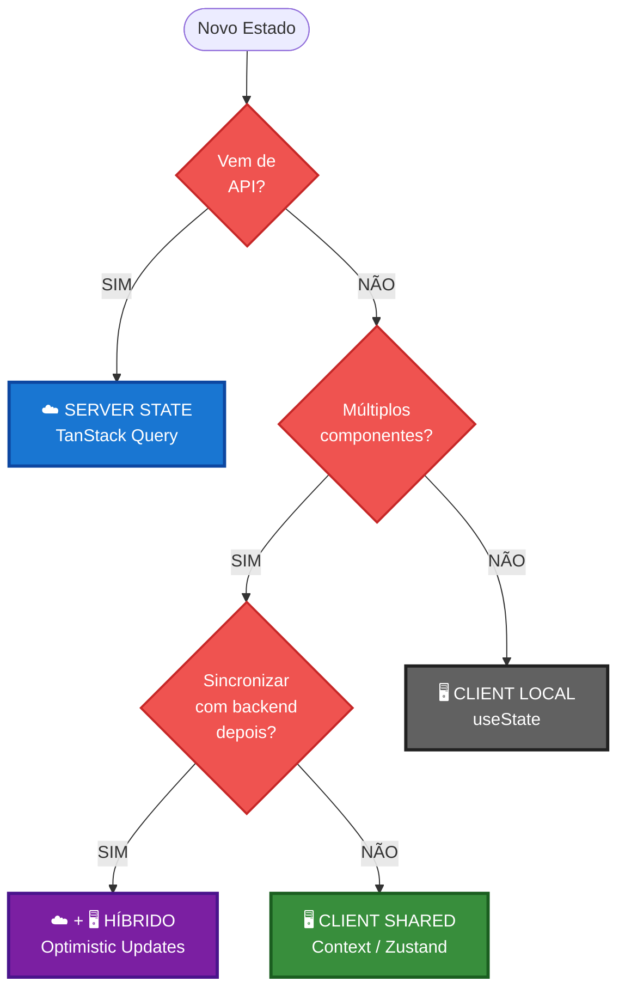

# Server State vs Client State: Guia Visual

> **Guia rápido para identificar e separar corretamente os dois tipos de estado**

---

## 🎭 Comparação Lado a Lado

| Aspecto              | ☁️ SERVER STATE                  | 🖥️ CLIENT STATE               |
| -------------------- | -------------------------------- | ----------------------------- |
| **Fonte da verdade** | 🌐 Backend/API                   | 💻 Frontend                   |
| **Controle**         | ❌ Você não controla             | ✅ Você controla totalmente   |
| **Volatilidade**     | ⚡ Pode mudar a qualquer momento | 🔒 Só muda quando você decide |
| **Sincronização**    | 🔄 Precisa refetch constante     | 🚫 Não precisa sincronizar    |
| **Cache**            | ✅ Essencial (evitar fetches)    | ❌ Não faz sentido            |
| **Shared**           | 🌍 Múltiplos usuários veem igual | 👤 Específico de cada usuário |
| **Persistência**     | 💾 Backend (banco de dados)      | 🗂️ Sessão ou localStorage     |
| **Loading state**    | ⏳ Assíncrono (sempre)           | ⚡ Síncrono (instantâneo)     |
| **Error handling**   | 🚨 Falhas de rede/servidor       | 🐛 Bugs de lógica             |
| **Stale time**       | ✅ Crítico (quando revalidar?)   | 🚫 Não se aplica              |

---

## 🗂️ Exemplos Categorizados da Loja Use Dev

### ☁️ SERVER STATE (TanStack Query)

```tsx
// 📦 Listagens de dados remotos
useQuery(["products"]); // GET /products
useQuery(["categories"]); // GET /categories
useQuery(["products", { featured: true }]); // GET /products?featured=true

// 🔍 Detalhes específicos
useQuery(["product", productId]); // GET /products/:id
useQuery(["stock", productId]); // GET /products/:id/stock
useQuery(["reviews", productId]); // GET /products/:id/reviews

// 👤 Dados do usuário
useQuery(["user", "profile"]); // GET /user/profile
useQuery(["user", "orders"]); // GET /user/orders
useQuery(["user", "wishlist"]); // GET /user/wishlist (se sincronizado)
```

**Por que TanStack Query?**

- ✅ Cache automático (não refetch a cada montagem)
- ✅ Stale time configurável (quando considerar "velho")
- ✅ Refetch automático (window focus, reconnect, interval)
- ✅ Retry em caso de erro
- ✅ Background updates (não trava UI)
- ✅ Deduplicação (5 componentes = 1 request)

---

### 🖥️ CLIENT STATE (Context/Zustand/Local)

```tsx
// 🛒 Carrinho (offline ou optimistic)
const [cartItems, setCartItems] = useState([]); // Local
// ou Context se compartilhado

// ❤️ Wishlist (IDs salvos localmente)
const [wishlistIds, setWishlistIds] = useState<number[]>([]);

// 🎨 Preferências de UI
const [theme, setTheme] = useState<"light" | "dark">("light");
const [language, setLanguage] = useState<"pt" | "en">("pt");

// 🧭 Estado de navegação
const [isSidebarOpen, setIsSidebarOpen] = useState(false);
const [activeTab, setActiveTab] = useState("description");

// 🔍 Inputs e formulários
const [searchQuery, setSearchQuery] = useState("");
const [selectedColor, setSelectedColor] = useState<string | null>(null);

// 🪟 Modals e overlays
const [isImageZoomOpen, setIsImageZoomOpen] = useState(false);
const [isCheckoutModalOpen, setIsCheckoutModalOpen] = useState(false);

// 📊 Filtros aplicados (se não na URL)
const [priceRange, setPriceRange] = useState<[number, number]>([0, 1000]);
const [selectedCategories, setSelectedCategories] = useState<string[]>([]);
```

**Por que useState/Context?**

- ✅ Síncrono (muda instantaneamente)
- ✅ Controle total (você decide quando/como muda)
- ✅ Sem overhead de network
- ✅ Efêmero ou persistido conforme necessário

---

## 🔀 Casos Híbridos (Server + Client)

Alguns dados precisam de **ambas** as abordagens:

### 1️⃣ Carrinho Sincronizado

```tsx
// ☁️ SERVER STATE: Carrinho no backend
const { data: serverCart } = useQuery({
  queryKey: ["cart"],
  queryFn: fetchCart,
  staleTime: 1 * 60 * 1000, // 1 minuto
});

// 🖥️ CLIENT STATE: UI otimista
const [optimisticCart, setOptimisticCart] = useState(serverCart);

// Mutation com optimistic update
const addToCartMutation = useMutation({
  mutationFn: addItemToServer,
  onMutate: async (newItem) => {
    // Atualiza UI imediatamente
    setOptimisticCart((prev) => [...prev, newItem]);
  },
  onError: () => {
    // Rollback em caso de erro
    setOptimisticCart(serverCart);
  },
  onSuccess: () => {
    // Sincroniza com servidor
    queryClient.invalidateQueries(["cart"]);
  },
});
```

**Benefícios:**

- ✅ UX instantânea (não espera servidor)
- ✅ Sincronização entre dispositivos
- ✅ Rollback automático em erro
- ✅ Cache inteligente

---

### 2️⃣ Filtros de Produtos

```tsx
// 🔗 URL STATE: Filtros compartilháveis
const [searchParams] = useSearchParams();
const categoryId = searchParams.get("category");
const priceMin = searchParams.get("price_min");

// ☁️ SERVER STATE: Produtos filtrados
const { data: products } = useQuery({
  queryKey: ["products", { categoryId, priceMin }],
  queryFn: () => fetchProducts({ categoryId, priceMin }),
});

// 🖥️ CLIENT STATE: UI de seleção
const [isPriceSliderOpen, setIsPriceSliderOpen] = useState(false);
```

**Três camadas:**

- 🔗 **URL**: Persistência e compartilhamento
- ☁️ **TanStack Query**: Dados filtrados com cache
- 🖥️ **Local**: Estado temporário da UI

---

## 🎯 Fluxograma de Decisão



---

## 🚨 Sinais de Mistura Incorreta

### ❌ Tratando Server State como Client State

```tsx
// ❌ Produtos no Context
const AppContext = createContext({
  products: [],
  fetchProducts: () => {},
});

// Problemas:
// 1. Sem cache (sair e voltar = fetch novamente)
// 2. Sem stale time (não sabe quando é velho)
// 3. Refetch manual (você precisa chamar fetchProducts)
// 4. Sem retry (falhou = fim)
// 5. Sem deduplicação (5 componentes = 5 fetches)
```

**Solução:**

```tsx
// ✅ Produtos com TanStack Query
const { data: products } = useQuery({
  queryKey: ["products"],
  queryFn: fetchProducts,
  staleTime: 5 * 60 * 1000,
});
```

---

### ❌ Tratando Client State como Server State

```tsx
// ❌ Tema com TanStack Query (overkill!)
const { data: theme } = useQuery({
  queryKey: ["theme"],
  queryFn: () => localStorage.getItem("theme") || "light",
});

// Problemas:
// 1. Overhead desnecessário (não é async de verdade)
// 2. Lógica de cache complexa pra algo simples
// 3. DevTools poluído com "queries" que não são queries
```

**Solução:**

```tsx
// ✅ Tema com useState + localStorage
const [theme, setTheme] = useState(
  () => localStorage.getItem("theme") || "light",
);

useEffect(() => {
  localStorage.setItem("theme", theme);
}, [theme]);
```

---

## 📊 Matriz de Decisão Rápida

|     | Vem de API | Múltiplos Componentes | Ferramenta         |
| --- | ---------- | --------------------- | ------------------ |
| ✅  | SIM        | -                     | ☁️ TanStack Query  |
| ❌  | NÃO        | SIM (sincronizado)    | ☁️ + 🖥️ Híbrido    |
| ❌  | NÃO        | SIM (local)           | 🖥️ Context/Zustand |
| ❌  | NÃO        | NÃO                   | 🖥️ useState        |

---

## 🎓 Checklist de Validação

Ao implementar um estado, pergunte:

### Para Server State (TanStack Query):

- [ ] Os dados vêm de uma API?
- [ ] Podem ficar desatualizados (stale)?
- [ ] Múltiplos usuários veem os mesmos dados?
- [ ] Precisa de cache?
- [ ] Pode falhar (erro de rede)?

**Se 3+ respostas SIM → TanStack Query**

---

### Para Client State (Context/Local):

- [ ] Você controla totalmente o estado?
- [ ] Os dados são específicos do usuário/sessão?
- [ ] Não precisa sincronizar com servidor?
- [ ] Muda de forma síncrona/instantânea?
- [ ] É efêmero ou persiste localmente?

**Se 3+ respostas SIM → Context/useState**

---

## 💡 Regras de Ouro

1. **"Se vem de API → TanStack Query"**  
   Sempre. Sem exceções.

2. **"Se é preferência de UI → Context/Local"**  
   Tema, idioma, sidebar = não é servidor.

3. **"Se precisa ser rápido → Optimistic Updates"**  
   Carrinho, likes, favoritos = híbrido.

4. **"Se stale time importa → TanStack Query"**  
   Estoque (30s), preços (1min), produtos (5min).

5. **"Se persiste entre sessões → localStorage + Context"**  
   Configurações, tour concluído, cookies aceitos.

---
