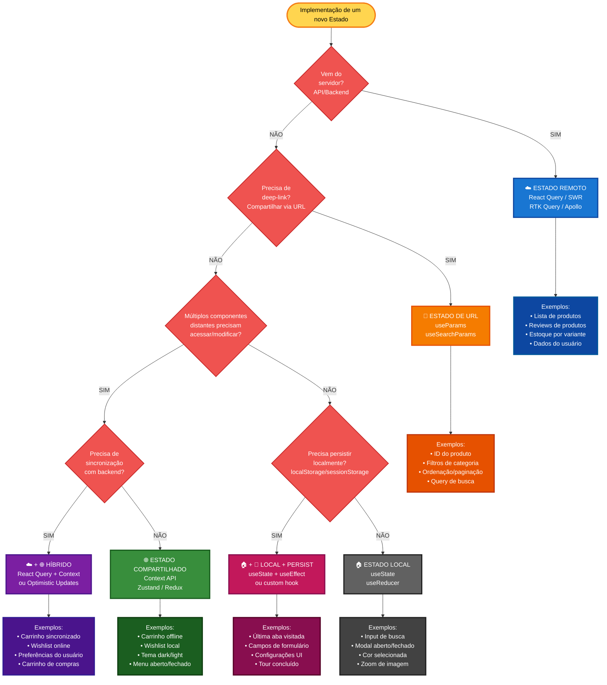

# Fluxo de Decisão para Escolha de Abordagem de Estado

## 🎯 Objetivo

Este documento apresenta um **fluxo de decisão repetível** para escolher a abordagem correta de gerenciamento de estado, evitando retrabalho e migrações dolorosas.

---

## 🌳 Árvore de Decisão (Fluxograma)



---

# 🏭 Caso Real: Filtro por Franquia

### ❌ Abordagem problemática (Retrabalho)

**Iteração 1 - Início ingênuo:**

```tsx
// ❌ Implementado com useState
function ProductList() {
  const [franchise, setFranchise] = useState<string | null>(null);

  return (
    <div>
      <select value={franchise} onChange={(e) => setFranchise(e.target.value)}>
        <option value="">Todas</option>
        <option value="marvel">Marvel</option>
        <option value="dc">DC Comics</option>
      </select>

      <Products franchise={franchise} />
    </div>
  );
}

// PROBLEMA: Ao recarregar a página, perde o filtro
// PROBLEMA: Não pode compartilhar link filtrado
```

**Iteração 2 - Migrando para URL (retrabalho doloroso):**

```tsx
// 😓 Reescrevendo tudo
function ProductList() {
  const [searchParams, setSearchParams] = useSearchParams();
  const franchise = searchParams.get("franchise");

  const handleChange = (value: string) => {
    setSearchParams((prev) => {
      const params = new URLSearchParams(prev);
      if (value) {
        params.set("franchise", value);
      } else {
        params.delete("franchise");
      }
      return params;
    });
  };

  // Teve que refatorar todo o código!
  // Teve que testar novamente!
  // Teve que atualizar documentação!
}
```

---
